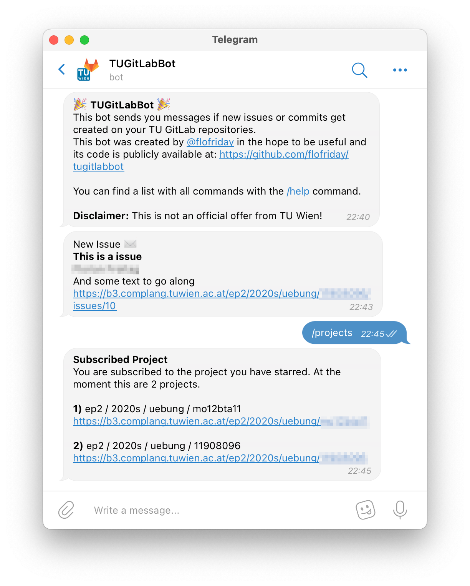

# tugitlabbot
A Telegrambot to notify about changes on the TU Wien GitLab repository.

## Build it yourself
1) Install golang
2) Run `go build`
3) Run `TELEGRAM_TOKEN=XXXX ./gitlabbot`
Where XXXX is the Token for the Telegrambot